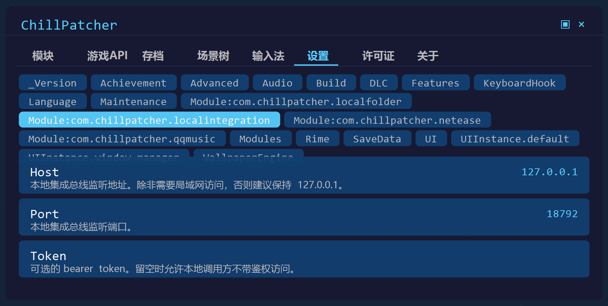
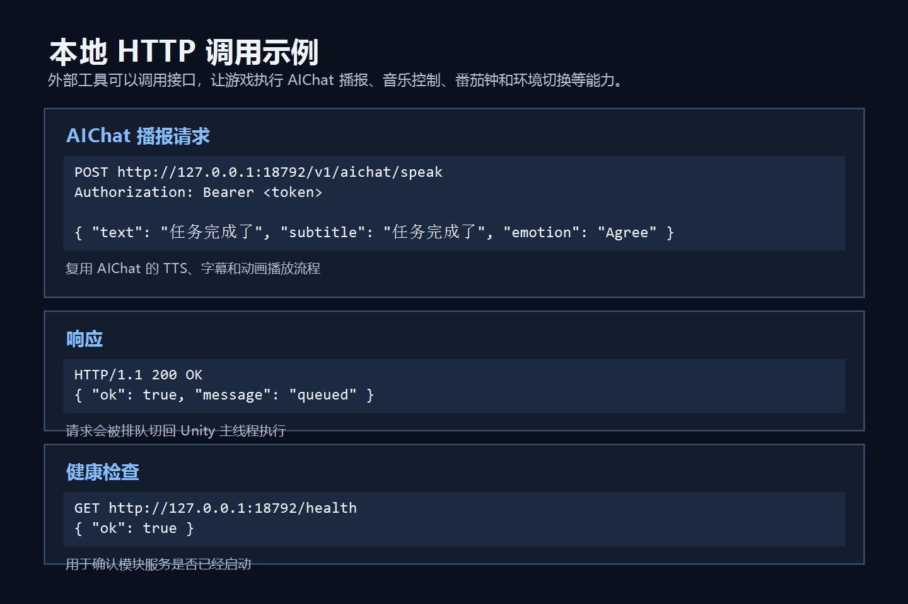

# 本地集成总线

本地集成总线是一个可选的 ChillPatcher 模块，用于接入可信的本地工具。
例如本地自动化脚本、桌面助手、vibe coding 辅助工具、直播/语音工作流、快捷键面板、Stream Deck 或其他只在本机运行的控制程序。
它在本机回环地址上启动 HTTP 服务，并把请求派发回 Unity 主线程执行。

总线本身只负责路由、鉴权和主线程调度。具体能力通过注册
`ILocalIntegrationHandler` 实现；总线不需要了解某个具体功能的业务细节。

## 示例截图





## 内置处理器

### 音频控制

`POST http://127.0.0.1:18792/v1/audio/control`

```json
{ "action": "next" }
```

支持的动作：

- `toggle`、`pause`、`resume`、`next`、`previous`
- `shuffle`，参数：`enabled`
- `repeatOne`，参数：`enabled`
- `mute`，参数：`muted`
- `progress`，参数：`progress`，范围 `0` 到 `1`
- `playByIndex`，参数：`index`
- `playByUuid`，参数：`uuid`

### 番茄钟控制

`POST http://127.0.0.1:18792/v1/pomodoro/control`

```json
{ "action": "start" }
```

支持的动作：

- `start`、`togglePause`、`skip`、`reset`、`completeNow`
- `moveAhead`，参数：`seconds`
- `setWorkMinutes`，参数：`minutes`
- `setBreakMinutes`，参数：`minutes`
- `setLoopCount`，参数：`loopCount`

### 环境控制

`POST http://127.0.0.1:18792/v1/environment/control`

```json
{ "action": "setSoundMute", "id": "Rain", "muted": true }
```

支持的动作：

- `setViewActive`，参数：`id`、`active`
- `setSoundVolume`，参数：`id`、`volume`
- `setSoundMute`，参数：`id`、`muted`
- `setAutoTimeEnabled`，参数：`enabled`
- `setAutoTimeHours`，参数：`dayStart`、`sunsetStart`、`nightStart`
- `loadPreset`，参数：`index`
- `savePreset`，参数：`index`

### AIChat 对话

`POST http://127.0.0.1:18792/v1/aichat/chat`

```json
{
  "text": "我们现在在做什么？",
  "inputSource": "localintegration"
}
```

该处理器会把文本交给 AIChat 自己的对话流程处理，包括 LLM 请求、TTS、字幕和动画。
`inputSource` 可选，默认值为 `localintegration`。

### AIChat 播报

`POST http://127.0.0.1:18792/v1/aichat/speak`

```json
{
  "text": "Codex finished this turn.",
  "subtitle": "Codex finished this turn.",
  "emotion": "Agree"
}
```

支持的表情：`Happy`、`Confused`、`Sad`、`Fun`、`Agree`、`Drink`、`Wave`、`Think`。

该处理器复用 AIChat 自己的 TTS 设置、字幕 UI 和动画播放流程，不会调用 AIChat 的 LLM 接口。
它和其他本地集成能力一样，通过 `ILocalIntegrationHandler` 注册到总线。

## 配置

模块配置写入：

`[Module:com.chillpatcher.localintegration]`

- `Host`：默认 `127.0.0.1`
- `Port`：默认 `18792`
- `Token`：可选的 bearer token。设置后，调用方必须发送 `Authorization: Bearer <token>` 或 `X-ChillPatcher-Token: <token>`。
